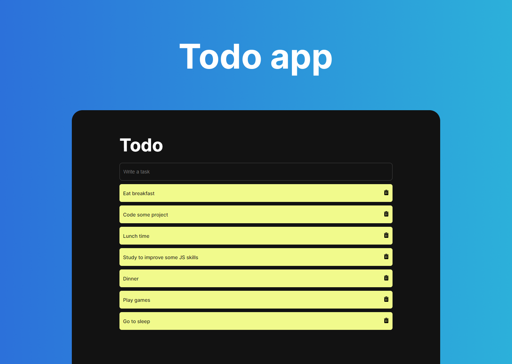

# Todo app

    

## Sobre

Todo app é uma aplicação para te ajudar na organização do seu dia, com a função de adicionar e remover suas principais tarefas.

## Tecnologias

Para o desenvolvimento deste projeto foram utilizadas as seguintes tecnologias:

- HTML
- CSS
- JavaScript

--
Desenvolvido com 💙 por [Lucas Rangel](https://www.linkedin.com/in/lucasrngl/)